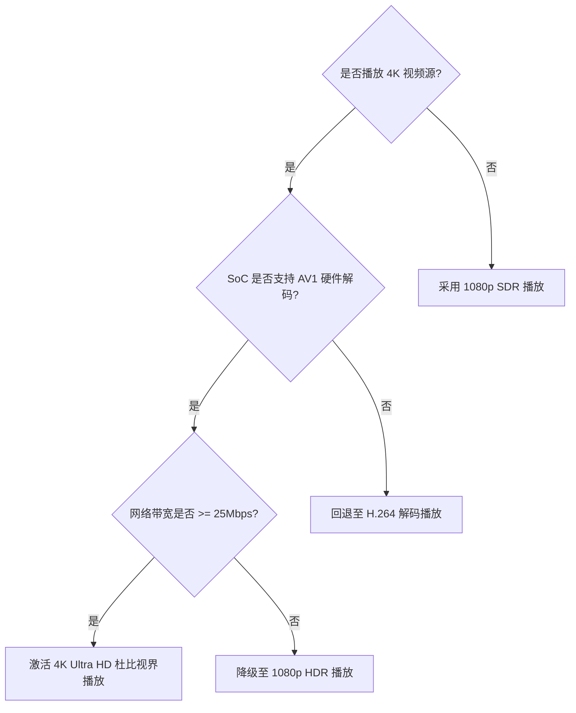

# 组件 - 决策树 (Decision Tree)

本组件用于规划算法策略或复杂的业务条件分支逻辑。

## 1. 决策分支树模板

```mermaid
graph TD
  A{是否播放 4K 视频源?} -->|是| B{SoC 是否支持 AV1 硬件解码?}
  A -->|否| C[采用 1080p SDR 播放]
  
  B -->|是| D{网络带宽是否 >= 25Mbps?}
  B -->|否| E[回退至 H.264 解码播放]
  
  D -->|是| F[激活 4K Ultra HD 杜比视界播放]
  D -->|否| G[降级至 1080p HDR 播放]
```

## 2. 设计规范
* 判定节点用花括号 `{}` 表达，行为节点用方括号 `[]` 表达。
* 分支上必须写清判定条件（如：>= 25Mbps）。
