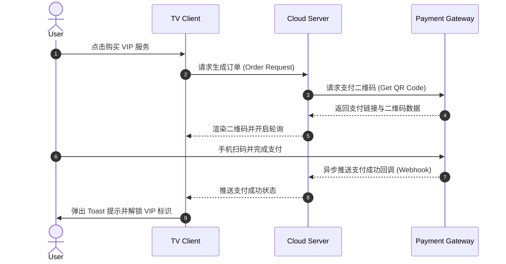

# 组件 - 业务流程与泳道图 (Flowcharts & Swimlanes)

本组件用于定义跨部门、跨系统的协作流程，明确各端的时序和处理判定。

## 1. 跨系统泳道图模板 (Swimlanes)

```mermaid
sequenceDiagram
  autonumber
  actor 用户 as User
  participant 电视端 as TV Client
  participant 服务器 as Cloud Server
  participant 支付网关 as Payment Gateway

  用户 ->> 电视端: 点击购买 VIP 服务
  电视端 ->> 服务器: 请求生成订单 (Order Request)
  服务器 ->> 支付网关: 请求支付二维码 (Get QR Code)
  支付网关 -->> 服务器: 返回支付链接与二维码数据
  服务器 -->> 电视端: 渲染二维码并开启轮询
  用户 ->> 支付网关: 手机扫码并完成支付
  支付网关 -->> 服务器: 异步推送支付成功回调 (Webhook)
  服务器 -->> 电视端: 推送支付成功状态
  电视端 ->> 用户: 弹出 Toast 提示并解锁 VIP 标识
```

## 2. 设计规范
* 泳道图中必须标注每个步骤的序号，采用 `autonumber`。
* 前后端的数据交互名应明确使用 `中文 (English)` 进行对照。
