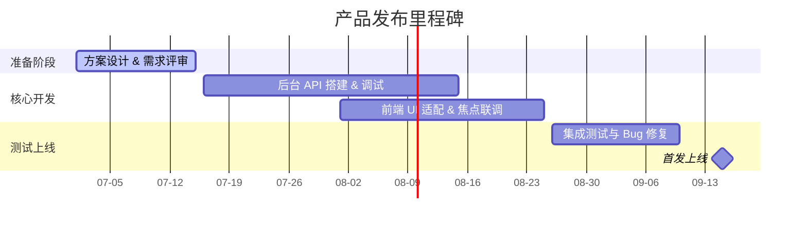

# 组件 - 阶段交付时间轴 (Timelines)

本组件用于向相关团队及管理层简明扼要地汇报产品项目关键节点。

## 1. 里程碑时间轴模板 (Milestone Timeline)

```mermaid
gantt
    title 产品发布里程碑
    dateFormat  YYYY-MM-DD
    axisFormat  %m-%d

    section 准备阶段
    方案设计 & 需求评审         :active, des1, 2026-07-01, 2026-07-15
    section 核心开发
    后台 API 搭建 & 调试        : des2, 2026-07-16, 2026-08-15
    前端 UI 适配 & 焦点联调      : des3, 2026-08-01, 2026-08-25
    section 测试上线
    集成测试与 Bug 修复        : des4, 2026-08-26, 2026-09-10
    首发上线                  : milestone, m1, 2026-09-15, 0d
```

## 2. 设计规范
* 使用 `milestone` 突出核心上线交付日。
* 明确区分开发并行阶段（如：前端开发与后台开发的部分重叠）。
