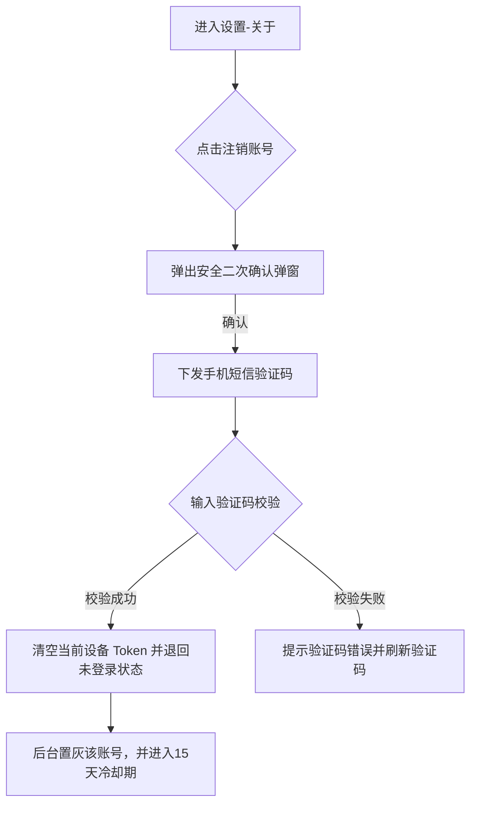

# 示例 - 账号注销功能产品需求文档 (PRD Example)

## 1. 文档信息
* 版本: V1.0.0
* 作者: ProductPilot
* 状态: Active
* 更新时间: 2026-07-11

## 2. 需求背景
根据《网络安全法》与个人信息保护法要求，系统必须向用户提供便捷的“注销账号”自助入口。

## 3. 业务流程

## 4. 详细交互与业务逻辑
### [Feature-01] 账号注销安全校验
* **前置条件**: 用户处于“已登录”状态。
* **交互规则**:
  - 点击“注销账号”后，页面弹出阻断式半透明弹窗（Modal Dialog）。
  - 弹窗标题: `注销账号安全确认` (L1)
  - 警示文案: `注销后该设备绑定的历史观影数据将永久清除且不可恢复` (L2)
* **校验逻辑**:
  - 短信验证码限时 **60 秒** 有效。
  - 单日验证码输入错误上限为 **5 次**。超过 5 次则锁定当前账号注销入口 24 小时。
* **异常处理**:
  - 若无网络，点击注销直接弹出 Toast 提示 `网络连接断开，请检查后重试`。

## 5. 验收标准 (AC)
* **AC-1**: 验证在未登录状态下，设置关于页面中无“注销账号”入口按钮。
* **AC-2**: 验证短信验证码连续输入错误 5 次后，注销入口变更为禁用（Disabled）置灰状态。
* **AC-3**: 验证账号注销成功后，数据库中对应用户的 `status` 字段修改为 `deprecated`，不再响应任何数据请求。
