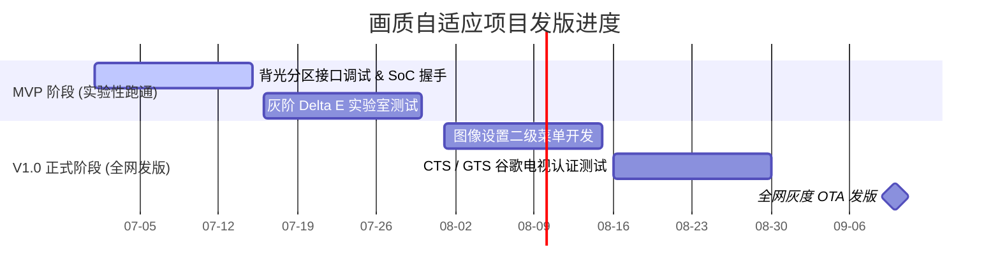

# 示例 - 画质自适应升级产品路线图 (Roadmap Example)

以下为一份脱敏的智能电视画质算法升级特性交付路线图：

---

## 1. 里程碑交付时间轴 (Gantt)

---

## 2. 关键依赖路径与风险
1. **阻碍点 (Blocker)**: 必须在 2026-07-15 前获取 SoC 芯片原厂提供的底层背光控制驱动库（SDK），否则 MVP 联调阶段将延期。
2. **法务隐私风险**: 智能画质检测需要实时抓取画面直方图（Histogram）分析场景。系统设计必须声明：“仅在本地内存中进行灰阶计算，不上传任何帧图像至云端服务器”。
