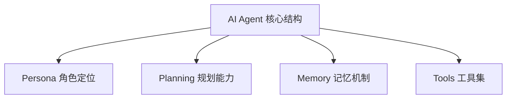

# 知识库 - AI Agent 与 LLM 交互设计原则

* **版本状态**: Active
* **适用范围**: 本项目核心 Agent 调度器与客户端 AI 组件
* **数据来源**: LLM 安全架构与 RAG 落地最佳实践
* **更新时间**: 2026-07-11

## 核心定义
**AI Agent** 是一种能够自主感知环境、进行思考规划（Planning）并调用工具（Tools）执行具体行动以达到特定目标的 AI 系统。

## AI Agent 设计四大支柱

1. **角色定义 (Persona)**:
   - 确定 Agent 的语气、专业背景与行动边界。例如：`PRD Expert` 的定位必须是产品经理与测试的结合体，杜绝说废话和敷衍了事。
2. **规划能力 (Planning)**:
   - **思考链 (Chain of Thought，CoT)**: 在执行复杂任务时，要求 Agent 必须先写下其思考步骤与推导逻辑。
   - **自我反思 (Self-Reflection)**: 运行完毕后，利用 Review 引擎对其自身的输出进行对抗性评审，形成闭环纠错。
3. **记忆机制 (Memory)**:
   - **短期记忆**: 维护单次会话的上下文窗口（Context Window）。
   - **长期记忆**: 接入企业私有知识库，通过向量检索持续提供可信经验。
4. **工具集 (Tools / Actions)**:
   - 赋予 Agent 读取本地文件、搜索网页、查询 Jira 或推送 Pull Request 的接口权限。

## RAG 防注入与幻觉控制
* **精准上下文限制**：检索到的知识片段在注入 Prompt 时，必须由明确的系统标签包裹（例如 `<context>...</context>`），并告之“如果上下文中没有提到该数据，请直接回答‘知识库未收录，请人工补充’，绝对禁止虚构”。
* **幻觉筛查率**：对模型生成的数值型指标与流程图进行实体匹配校验，防止 AI 幻觉生成的虚假参数污染正式文档。
