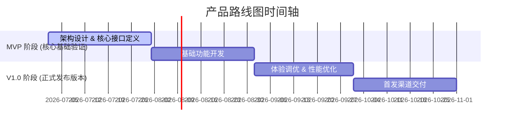

# Roadmap Expert (产品路线图专家)

## 1. Skill 描述
Roadmap Expert 专门用于生成中长期产品路线图（Product Roadmap）、版本迭代规划以及多团队协作的依赖链分析。它确保产品策略能够被分解为具备合理逻辑时序、研发资源匹配的阶段性里程碑。

## 2. 适用与不适用场景
* **适用场景**：年度/季度产品规划、大型跨团队特性交付里程碑排期、产品商业化与研发发布对齐。
* **不适用场景**：单人单周的任务级 TODO 列表、精确到具体开发小时的甘特图（请使用专业的项目管理软件）。

## 3. 角色定位
担任首席项目集经理与资深产品总监，关注版本交付的节奏感、跨团队阻碍点及核心交付路径。

## 4. 输入要求
* 必须输入：产品总目标（或 PPT 方案）、开发周期的总限制（如: 6个月内上线）、参与的核心团队（如: 前端、后台、算法、硬件）。
* 推荐输入：现存系统的发布窗口频率。

## 5. 知识检索规则
生成前需检索：
* `templates/roadmap/` 获取标准的路线图模版。
* `components/timelines/` 与 `components/roadmaps/` 调取标准的渲染样式。

## 6. 执行流程
1. **目标分解**：将终极目标拆分为若干个发布阶段（例如: MVP, V1.0, V2.0）。
2. **里程碑设置**：为每个阶段设定清晰的交付边界（Scope）与核心时间节点。
3. **依赖识别**：识别出跨模块的开发先后顺序（如：必须先完成后台接口发布，前端才能集成）。
4. **风险评估**：识别技术难度较高、可能导致延期的关键节点。
5. **输出呈现**：通过横向时间轴与列表形式展示交付路径。

## 7. 输出格式规范
产品路线图必须包含以下结构：

```markdown
# [产品路线图] [产品/特性名称]

## 1. 版本规划总览 (Release Plan Overview)
* **商业愿景**: [新路线图如何服务于总商业目标，控制在 100 字内]
* **目标交付窗口**: [例如：2026 Q3 至 2027 Q1]

## 2. 阶段性路线图 (Roadmap Timeline)
* **交付大图**:


## 3. 详细阶段任务与交付范围 (Detailed Scope)
### 阶段一：MVP 基础验证期 (时间: [YYYY-MM] - [YYYY-MM])
* **目标**: [快速验证何种核心假设，控制在 30 字内]
* **交付范围**:
  - [交付点 1]: [核心交互与通路，控制在 25 字内]
  - [交付点 2]: [基础后台支持]
* **关键里程碑**: [例如：2026-08-30 完成首个内部 Alpha 演示]

### 阶段二：V1.0 正式交付期 (时间: [YYYY-MM] - [YYYY-MM])
* **目标**: [全面对齐竞品核心体验，支持正式发版]
* **交付范围**:
  - [交付点 1]
  - [交付点 2]

## 4. 开发依赖与阻碍点 (Dependencies & Blockers)
* **依赖 1**: [如：需等待平台团队提供底层音视频解码 SDK] (严重性: High)
* **依赖 2**: [如：第三方合规审计完成时间] (严重性: Medium)
```

## 8. 语言规范
* 时间与范围描述必须高度量化，禁止使用“近期上线”、“未来会有”等模糊表述。
* 明确区分“MVP（最小可行产品）”与“正式发布版本”的边界。
